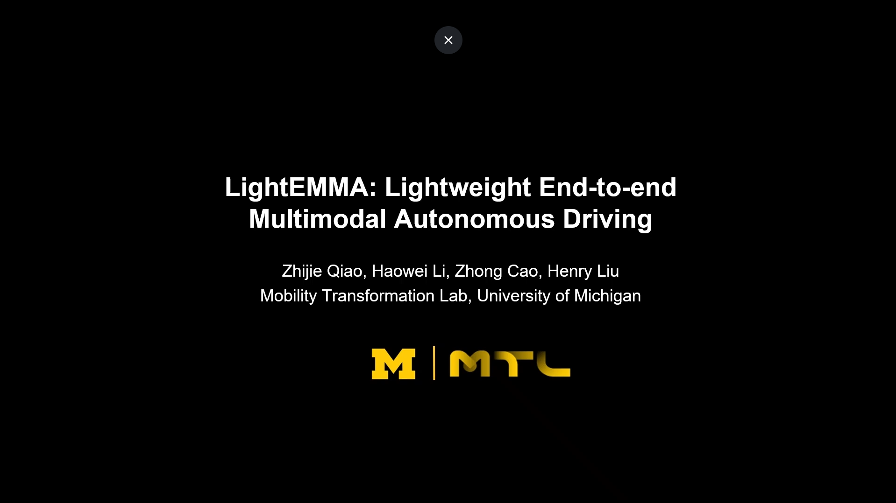

# LightEMMA: Lightweight End-to-End Multimodal Model for Autonomous Driving

[](https://arxiv.org/abs/2505.00284)
[](https://www.nuscenes.org/nuscenes)
[](https://huggingface.co/)

## Introduction

**LightEMMA** is a lightweight, modular framework for end-to-end autonomous driving, designed to leverage the zero-shot reasoning capabilities of state-of-the-art vision-language models (VLMs). Drawing inspiration from Waymo's [**EMMA**](https://waymo.com/research/emma/) (End-to-End Multimodal Model for Autonomous Driving), LightEMMA integrates broad world knowledge from large-scale vision-language models into an open and extensible research platform.

The framework enables rigorous open-loop evaluation of driving action and trajectory prediction using real-world scenarios from the [**nuScenes**](https://www.nuscenes.org/nuscenes) dataset. By supporting a diverse suite of leading VLMs—including **GPT**, **Claude**, **Gemini**, **Qwen**, **LLaMA**, **DeepSeek**—LightEMMA provides standardized benchmarking and comparative analysis across architectures, while its modular codebase streamlines rapid prototyping and model integration.

[](https://youtu.be/6Nr8Vu9wwpI)

## Table of Contents

- [Key Features](#key-features)
- [Overview](#overview)
- [Supported Models](#supported-models)
- [Environment Setup](#environment-setup)
  - [Installation](#installation)
  - [Dataset Preparation](#dataset-preparation)
  - [Configuration](#configuration)
- [Usage](#usage)
  - [Code Structure](#code-structure)
  - [Prediction](#prediction)
  - [Evaluation](#evaluation)
- [License](#license)
- [Citation](#citation)

## Key Features

- 🧱 **Baseline Framework**: A modular codebase for end-to-end autonomous driving tasks, supporting seamless integration of new vision-language models and rapid iteration as the field advances.

- 📊 **Comprehensive Evaluation**: Standardized evaluation on 150 test scenarios from the nuScenes prediction benchmark, reporting inference time, computational efficiency, prediction accuracy, and common failure cases. This thorough analysis helps identify strengths and limitations, guiding future research directions.


## Overview

LightEMMA processes front-camera images from the nuScenes dataset and leverages VLMs using a chain-of-thought (CoT) reasoning approach.

1. **Scene Description**: Generate detailed descriptions of the driving environment, including lane markings, traffic lights, vehicles, pedestrian activities, and other pertinent objects.
2. **Driving Intent Analysis**: Understand the driving intent from the current scene and the ego vehicle's historical actions to predict the subsequent high-level driving maneuver.
3. **Trajectory Prediction**: Convert high-level driving intentions into low-level driving actions, specifying precise speed and curvature values.

This end-to-end approach allows LightEMMA to leverage the rich semantic understanding capabilities of VLMs for zero-shot autonomous driving.


## Supported Models

> **Note:** Support for DeepSeek-VL has been discontinued due to poor stability and performance.

**Commercial API-based models**:
- [`gpt-series`](https://platform.openai.com/docs/models): Any model available via OpenAI API (e.g. `chatgpt-4o-latest`).
- [`claude-series`](https://docs.anthropic.com/claude/docs/models-overview): Any model available via Anthropic API (e.g. `claude-3-7-sonnet-latest`).
- [`gemini-series`](https://ai.google.dev/models/gemini): Any model available via Google API (e.g. `gemini-2.5-flash`).

**Open-source Local models**:
requires high-performance, high-memory CUDA-compatible GPUs (e.g., NVIDIA L40, H100). Multi-GPU setups advised for scaling large models and accelerating inference.

- [`qwen2.5-7b`](https://huggingface.co/Qwen/Qwen2.5-VL-7B-Instruct): Qwen2.5-VL-7B-Instruct.
- [`qwen2.5-72b`](https://huggingface.co/Qwen/Qwen2.5-VL-72B-Instruct): Qwen2.5-VL-72B-Instruct.
- [`llama-3.2-11b`](https://huggingface.co/meta-llama/Llama-3.2-11B-Vision-Instruct): Llama-3.2-11B-Vision-Instruct.
- [`llama-3.2-90b`](https://huggingface.co/meta-llama/Llama-3.2-90B-Vision-Instruct): Llama-3.2-90B-Vision-Instruct.

## Environment Setup

### Installation

Clone the repository:

```bash
git clone https://github.com/michigan-traffic-lab/LightEMMA.git
```

We recommend using Anaconda to manage dependencies:

```bash
cd LightEMMA
conda create -n lightemma python=3.10 pip
conda activate lightemma
```

Install LightEMMA dependencies:
```bash
# Install dependencies
pip install -r requirements.txt

# (Optional) Install PyTorch with CUDA support for local models.
# Replace 'cu129' with the appropriate CUDA version for your GPU.
pip install --upgrade torch torchvision --index-url https://download.pytorch.org/whl/cu129
```

### Dataset Preparation

Register an account for [**nuScenes**](https://www.nuscenes.org/nuscenes). Download the **Full dataset (v1.0)** and extract it to your desired location. We recommend starting with `v1.0-mini` for initial experiments, then proceeding to a full evaluation using `v1.0-test`. All experiments in this evaluation use the **US** dataset version. 

The dataset should have the following structure:
```
/path/to/nuscenes/
├── maps/
├── samples/
│   ├── CAM_BACK/
│   ├── CAM_BACK_LEFT/
│   ├── CAM_BACK_RIGHT/
│   ├── CAM_FRONT/
│   ├── CAM_FRONT_LEFT/
│   ├── CAM_FRONT_RIGHT/
│   ├── LIDAR_TOP/
│   └── RADAR_FRONT/
├── sweeps/
├── v1.0-mini
├── v1.0-test
└── README.md
```

### Configuration

Update the following in `config.yaml`:

- Commercial model API keys.
- Hugging Face download token.
- Local model download directory.
- Path to nuScenes dataset.

## Usage

### Code Structure

- `predict.py`: Main script for generating predictions.
- `evaluate.py`: Evaluates prediction results for a single model output.
- `evaluate_all.py`: Processes output from all models for comparison.
- `vlm.py`: Utility functions to run vision-language models.
- `utils.py`: Utility functions for trajectory calculations and visualization.
- `requirements.txt`: Lists package dependencies for installation.


### Prediction

We use GPT-4o in the following examples, but you can substitute it with any supported model type.

Run prediction on all scenes:

```bash
python predict.py --model chatgpt-4o-latest
```

Run prediction on a specific scene:

```bash
python predict.py --model chatgpt-4o-latest --scene scene-0103
```

Resume from a previous run:

```bash
python predict.py --model chatgpt-4o-latest --continue_dir results/gpt-4o
```

### Evaluation

We recommend starting with the provided pre-recorded results for quick evaluation.

Evaluate a single model:

```bash
python evaluate.py --results_dir results/gpt-4o
```

Enable error handling (see section IV.C of the paper):

```bash
python evaluate.py --results_dir results/gpt-4o --error_handling
```

Enable visualization during evaluation:

```bash
python evaluate.py --results_dir results/gpt-4o --error_handling --visualize
```

Evaluate all models and generate overall analysis:

```bash
python evaluate_all.py --results_dir results
```

## License

This project is licensed under the MIT License - see the [**LICENSE**](LICENSE) file for details.

## Citation

If you use LightEMMA in your research, please consider citing:

```bibtex
@article{lightemma,
      title={LightEMMA: Lightweight End-to-End Multimodal Model for Autonomous Driving}, 
      author={Zhijie Qiao and Haowei Li and Zhong Cao and Henry X. Liu},
      year={2025},
      eprint={2505.00284},
      url={https://arxiv.org/abs/2505.00284}, 
}
```
